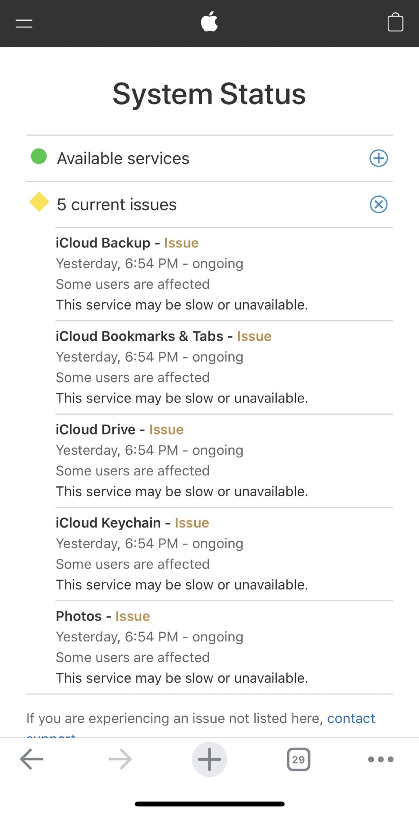

English | [中文](https://github.com/gongzhang/awesome-icloud-503/blob/main/README.zh-Hans.md)

# Awesome iCloud 503

> __iCloud: Service Unavailable 503__

Help 🍎 Apple track and resolve the issue about iCloud 503 service unavailable error.

## November 2021 - what's happening with iCloud?

I'm an indie app developer on the Apple platform. Starting around November 2021 (maybe October), I've been getting reports from users that the iCloud sync feature in my app is not working at all. A typical error message is as follows.

```
<CKError: "Service Unavailable" (6/2022); "Request failed with http status code 503"; uuid = ...>
```

Although this error has occurred in the past, it has been quickly and automatically recovered. But this time it's different: once a user encounters an iCloud 503 error, there seems to be __no way to recover on your own__. I analyzed the data and found that about 1% - 2% of my app users were suffering from this problem.

After some research, I found that many apps were experiencing the same problem (see [Related Articles and Discussions](#related-articles-and-discussions])). It was clear that iCloud itself was at fault. With no effective solution, users who encountered the problem had to give up using the iCloud sync feature in the app altogether, or even abandon the app altogether.

## December 2021 - The Turnaround

In mid-December 2021, things started to turn around. Analytics data from my app showed a dramatic reduction in iCloud 503 errors. Apple seems to be aware of the iCloud problem and has fixed it. Unfortunately, however, an equal number of another type of iCloud error began to appear.

```
<CKError: "Server Record Changed" (14/2004); server message = "record to insert already exists"; uuid = ...>
```

I get this error when I update a data using `CKModifyRecordsOperation`. iCloud seems to be telling me: "You can't update this data because it already exists". Can't figure it out.

The good news is that I found that now I can just delete the old iCloud record and then re-insert it again, and the problem is completely solved. At this point, my users seem to be saved.

## January 10, 2022 - 12 hours of iCloud downtime

On January 10, 2022 at around 8pm (CST), I suddenly found that iCloud syncing was not working on all my devices, not only my own apps, but also third-party apps, and even Apple apps. Yes, once again, there was an iCloud 503 error, and it seemed to be global.



The next morning (12 hours have passed), the [Official Apple Service Status](https://www.apple.com/support/systemstatus/) page started exposing the problem. After about another 1-2 hours, iCloud service gradually returned to normal.

## Late January 2022 - The Problem Returns

After the January 10 incident, I was very frustrated to find that the iCloud 503 issue seems to be back. A small number of users have started experiencing iCloud 503 errors again and are never able to recover. I have not found an effective solution for my users so far.

## Related Articles and Discussions

- [GoodNotes: iCloud sync stops working due to "Request failed with HTTP Status Code 503" error.](https://support.goodnotes.com/hc/en-us/articles/4410195261327-iCloud-sync-stops-working-due-to-Request-failed-with-HTTP-Status-Code-503-error-)
- [MacRumors: Developers Unhappy With Bug Causing iCloud Unreliability](https://www.macrumors.com/2022/01/24/developers-icloud-unreliability-bug/)
- [cnBeta.COM: 开发者抱怨iCloud服务器出现稳定问题 导致无法正常同步](https://www.cnbeta.com/articles/tech/1229847.htm)
